# Modelo de datos

Diagrama de entidades y relaciones del sistema. La fuente de verdad es
`server/prisma/schema.prisma`; este documento explica el *porqué* de las
decisiones que no se leen solas en el esquema.

## Diagrama

```mermaid
erDiagram
    USUARIOS ||--o{ REFRESH_TOKENS : "abre sesiones"
    USUARIOS ||--o{ AUDIT_LOG : "genera"
    USUARIOS ||--o{ NOTIFICACIONES : "recibe"
    USUARIOS ||--o{ ADJUNTOS : "sube"
    ABOGADOS ||--o| USUARIOS : "puede tener login"

    ABOGADOS ||--o{ CLIENTES : "atiende"
    ABOGADOS ||--o{ EXPEDIENTES : "es responsable"
    ABOGADOS ||--o{ EVENTOS_PUNTUALES : "tiene a cargo"
    ABOGADOS ||--o{ EVENTOS_RECURRENTES : "tiene a cargo"

    CLIENTES ||--o{ EXPEDIENTES : "es parte en"
    CLIENTES ||--o{ HONORARIOS : "pacta"

    EXPEDIENTES ||--o{ EVENTOS_PUNTUALES : "tiene plazos"
    EXPEDIENTES ||--o{ GASTOS : "genera gastos"
    EXPEDIENTES ||--o{ HONORARIOS : "puede imputar"

    HONORARIOS ||--o{ HONORARIO_PAGOS : "se cobra en"
    EVENTOS_RECURRENTES ||--o{ RECURRENTE_CUMPLIMIENTOS : "registra periodos"

    CATALOGO_ITEMS ||--o{ CLIENTES : "provincia / origen"
    CATALOGO_ITEMS ||--o{ EXPEDIENTES : "fuero / juzgado / etapa / estado"
    CATALOGO_ITEMS ||--o{ EVENTOS_PUNTUALES : "tipo"
    CATALOGO_ITEMS ||--o{ EVENTOS_RECURRENTES : "tipo"
    CATALOGO_ITEMS ||--o{ GASTOS : "rubro / medio de pago"
    CATALOGO_ITEMS ||--o{ HONORARIO_PAGOS : "medio de pago"
    CATALOGO_ITEMS ||--o{ PLAZO_TIPOS : "fuero"

    USUARIOS {
        int id PK
        string email UK
        string passwordHash "bcrypt, nunca en claro"
        enum rol "ADMIN|ABOGADO|SECRETARIA|LECTURA"
        int intentosFallidos "anti fuerza bruta"
        datetime bloqueadoHasta
        int abogadoId FK "opcional"
    }

    REFRESH_TOKENS {
        int id PK
        string tokenHash UK "SHA-256, no el token"
        string familia "rotacion + deteccion de reuso"
        datetime usadoEn
        datetime revocadoEn
    }

    AUDIT_LOG {
        int id PK
        int usuarioId FK
        string entidad
        int entidadId
        enum accion
        string campo "un renglon POR CAMPO"
        text valorAnterior
        text valorNuevo
        string ip
    }

    CLIENTES {
        int id PK
        string codigo UK "CLI-001"
        enum tipoPersona "FISICA|JURIDICA"
        string nombre "es un DATO, no la llave"
        string documento "DNI o CUIT"
        enum estado
        date fechaAlta
        int version "bloqueo optimista"
        datetime eliminadoEn "borrado logico"
    }

    EXPEDIENTES {
        int id PK
        string codigo UK "EXP-001"
        string caratula
        int clienteId FK
        enum caracter
        date ultimaActuacion "base de la caducidad"
        decimal montoReclamado
        int mesesCaducidad "null = default de config"
        date fechaPrescripcion
        int version
        datetime eliminadoEn
    }

    EVENTOS_PUNTUALES {
        int id PK
        string codigo UK "EVT-001"
        date fechaVto "DATE puro, sin zona horaria"
        string hora "HH:mm, informativa"
        string descripcion
        int expedienteId FK "null = evento del estudio"
        enum prioridad
        enum estado
    }

    EVENTOS_RECURRENTES {
        int id PK
        string codigo UK "REC-001"
        enum periodicidad
        date fechaBase "desde aca se proyecta"
        boolean activo
    }

    RECURRENTE_CUMPLIMIENTOS {
        int id PK
        int recurrenteId FK
        string periodoClave "fecha de la ocurrencia"
        datetime cumplidoEn
        string cumplidoPor
    }

    HONORARIOS {
        int id PK
        string codigo UK "HON-001"
        int clienteId FK
        int expedienteId FK "opcional"
        enum tipoPacto
        decimal montoPactado
        decimal ivaPorcentaje "0 | 10.5 | 21"
    }

    HONORARIO_PAGOS {
        int id PK
        int honorarioId FK
        date fecha
        decimal monto
    }

    GASTOS {
        int id PK
        string codigo UK "GTO-001"
        date fecha
        enum tipo "EXPEDIENTE|ESTUDIO"
        int expedienteId FK "obligatorio si tipo=EXPEDIENTE"
        decimal importe
        boolean reembolsable
        enum estadoReintegro
    }

    CATALOGO_ITEMS {
        int id PK
        enum tipo
        string valor
        boolean activo "se desactiva, no se borra"
        string scope "rubros: EXPEDIENTE|ESTUDIO"
        boolean computaComoActivo "estados: cuenta como causa activa"
    }

    CONFIG_ESTUDIO {
        int id PK "fila unica = 1"
        string nombreEstudio
        int diasPorVencer "umbral del semaforo"
        int ventanaProximos
        decimal valorJus
        int mesesCaducidadDefault
    }

    FERIADOS {
        int id PK
        date fecha
        string jurisdiccion
    }

    FERIAS_JUDICIALES {
        int id PK
        date desde
        date hasta
        string jurisdiccion
    }

    PLAZO_TIPOS {
        int id PK
        string nombre
        int dias
        enum computo "HABILES|CORRIDOS"
        int fueroId FK
    }

    ADJUNTOS {
        int id PK
        string entidadTipo "polimorfico controlado"
        int entidadId
        string nombreArchivo UK "uuid generado por el servidor"
        string hash "SHA-256 del contenido"
    }

    NOTIFICACIONES {
        int id PK
        int usuarioId FK
        enum tipo
        string claveDedupe "evita avisos repetidos"
        datetime leidaEn
    }
```

## Las siete decisiones que explican el resto

### 1. Todo se relaciona por ID, nunca por texto

En la planilla, el nombre del cliente era la llave: los expedientes, los
honorarios y la cuenta corriente se enganchaban por el texto. Renombrar
"Pérez, Juan Carlos" desenganchaba silenciosamente sus registros, y la propia
guía del Excel advertía que había que ir a corregirlos a mano uno por uno.

Acá el nombre es un dato más. Toda relación es una clave foránea a un `id`
autoincremental. Se puede corregir un nombre mal escrito sin miedo.

### 2. Lo calculado no se persiste

Semáforos, saldos, próximos vencimientos, días restantes y porcentajes de
cobranza **no son columnas**: se derivan en el backend en cada consulta.

El motivo es que dependen del día de hoy. Un campo "situación" guardado en la
base queda desactualizado apenas cambia la fecha, y la única forma de
mantenerlo sería un proceso nocturno que lo recalcule todo — más piezas, más
para romperse, y una ventana en la que los datos mienten.

### 3. Las fechas de vencimiento son `DATE` puro

Un vencimiento es un día del calendario, no un instante. Guardarlo como
`DATETIME` obliga a elegir una hora arbitraria y abre la puerta al bug de zona
horaria: un contenedor en UTC, a las 21:30 de Buenos Aires, ya está en el día
siguiente.

Los sellos de auditoría, en cambio, sí son instantes y van en UTC.
Ver `server/src/utils/fechas.js`.

### 4. Los pagos son filas, no un acumulado

El Excel tenía una columna "cobrado" que se escribía a mano, y su propia guía
advertía del bug: *"si repetís un cliente en dos renglones, el cobrado se
duplica"*.

Acá el cobrado es `SUM(honorario_pagos.monto)`. No hay ningún lugar donde
escribirlo mal, y de yapa queda el detalle de cada cobro con su fecha y su
medio de pago — que es lo que necesita la cuenta corriente.

### 5. Los catálogos se desactivan, no se borran

La guía del Excel advertía: *"si borrás un valor de una lista que ya usaste, ese
registro queda con un texto que ya no está en el desplegable"*.

Los `catalogo_items` tienen `activo`. Al "eliminar" una opción se desactiva:
deja de ofrecerse para cargas nuevas, pero los registros históricos la siguen
mostrando porque apuntan a su `id`.

### 6. Borrado lógico y bloqueo optimista

Todo lo que tiene historial económico o procesal lleva `eliminadoEn` (baja
lógica) y `version` (bloqueo optimista).

La `version` es la respuesta al riesgo de pasar de un Excel de un solo usuario
a una app multiusuario: si dos personas editan el mismo expediente, la segunda
recibe un **409** con el detalle, en vez de pisar el trabajo de la primera sin
que nadie se entere.

### 7. Los recurrentes no se materializan

Un evento semanal cargado hace tres años generaría cientos de filas basura. Las
ocurrencias se proyectan en memoria desde `fechaBase + periodicidad`
(`server/src/services/recurrentes.service.js`).

Lo único que se persiste es el **cumplimiento** de una ocurrencia concreta, con
clave `(recurrenteId, periodoClave)`. Eso hace la operación idempotente y deja
el historial completo — a diferencia del tilde del Excel, que había que borrar
a mano a fin de mes y no dejaba rastro.

## Índices

Los índices siguen los patrones de acceso reales, no "por si acaso":

| Tabla | Índice | Para qué |
|---|---|---|
| `eventos_puntuales` | `(fechaVto, estado)` | Es el patrón de casi todas las vistas: filtrar por estado y ordenar por fecha |
| `eventos_puntuales` | `expedienteId`, `responsableId` | Ficha del expediente y carga por abogado |
| `expedientes` | `clienteId`, `abogadoId`, `estadoId` | Filtros de la grilla y del tablero |
| `clientes` | `nombre`, `estado`, `eliminadoEn` | Búsqueda y filtros |
| `gastos` | `fecha`, `tipo`, `estadoReintegro` | Resumen del período y pendientes de reintegro |
| `honorarios` | `clienteId`, `fechaPacto` | Cuenta corriente y facturado del período |
| `catalogo_items` | `(tipo, activo, orden)` | Carga de todos los desplegables en una consulta |
| `audit_log` | `(entidad, entidadId)`, `creadoEn` | "Qué le pasó a este registro" |
